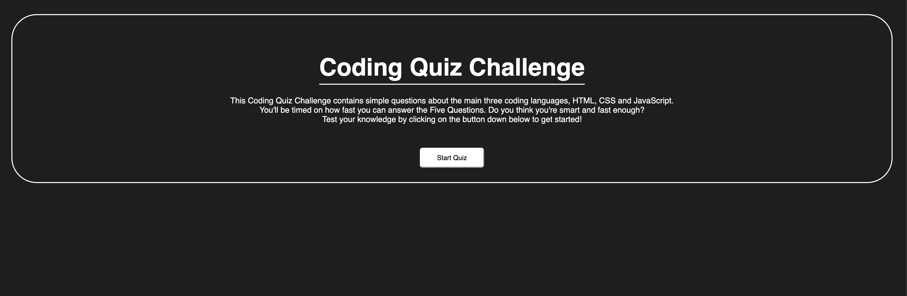
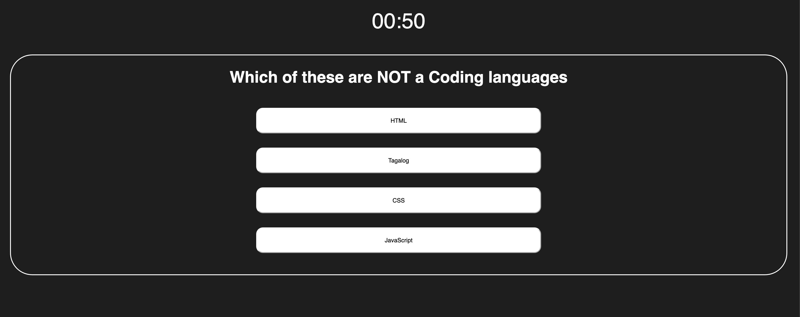

# My Coding Quiz Challenge

## Description

This project, tests the User's basic knowledge of the core languages of HTML, CSS, and JavaScript.

As a full stack developer, being able manipulate the DOM and understanding how to use JavaScript is very essential when it comes to having a User interacting with your webpage. Being able to create a simple quiz, tests my skills as a developer to help guide the user on their choices and to help myself understand them.

Things I have learned is that, when it comes to HTML, and CSS those are my strongest areas since I love the creativity to design and style my webpage to my liking. Although JavaScript can do the same as in being able to have full control with the functionality. I found out that JavaScript was one of my weaknesses, testing my problem solving skills. Doing this challenge, definitely helped me improve on my problem skills, but of course there is always room for improvement!

## IMAGE(s)

## LINK(s)
Deployed Application link: https://lifewawj.github.io/my-coding-quiz-challenge/

## Features
A Countdown Timer: when user begins the quiz they are presented by a countdown timer, that ticks until they have gone through all the questions, or when the timer hits zero.

Interactable buttons:
- "Start Quiz" button: begins the quiz, and is introduce by the first question.
- "Restart" button: being able to play the quiz again by simply clicking a button, without having to refresh the page!
- "Clear Leaderboard" button: cleans/hides the old existing names off the Leaderboard.
- The Answer buttons: being able to choose the right/wrong answer to the assigned question.

Adding your Name/Intial to the Leaderboard: write your name/intials in a input bar, and clicking a add button beside it to add the user's input onto the leaderboard.
